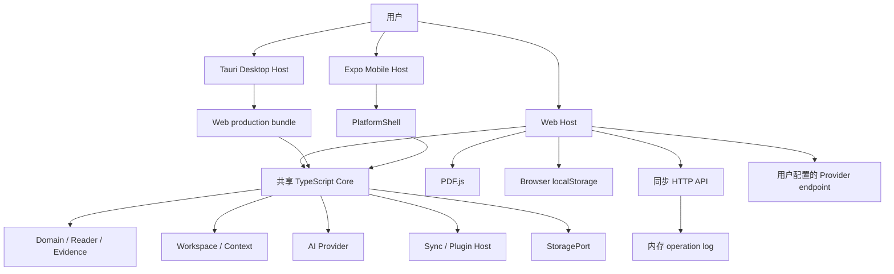

# PaperWithA 项目总览

- 文档日期：2026-07-24
- 文档性质：当前实现与目标设计的事实分离说明
- 目标读者：接手工程师、Coding Agent、架构评审和产品负责人

## 1. 项目是什么

PaperWithA 是一个以论文原文和证据锚点为中心的本地优先 AI 阅读工作台。目标体验是：连续阅读论文、对选区执行解释与批注、维护显式 AI 上下文、生成结构化 Reading Brief，并在 Web、Desktop 和 Mobile 之间共享领域语义。

目标设计采用“共享领域核心 + 平台 Host + 受控插件”模式：

- 共享核心负责 DocumentGraph、PaperView、EvidenceAnchor、LayoutTree、ContextSet、ProviderManifest 和 SyncEnvelope；
- Web / Desktop / Mobile 分别实现适合平台的 UI 与系统能力；
- Provider、分析、导入、导出和同步最终通过受限插件边界扩展；
- 本地阅读不依赖云端 AI 或同步服务。

## 2. 当前成熟度结论

当前仓库是**可运行的产品切片与架构验证实现**，不是正式 Spec 的完整产品。

### 已直接实现并验证

- pnpm TypeScript monorepo 和 17 个 workspace；
- Web 论文库、PDF / TXT / Markdown 导入、连续阅读、内部滚动、选区工具栏、本地批注、基础 Chat 和基础 Reading Brief；
- Browser localStorage 持久化；
- 声明式 ProviderManifest 校验、HTTP JSON / SSE 客户端和本地真实 HTTP 测试；
- ContextSet 的文档白名单、固定来源优先、词法排序和预算裁剪；
- EvidenceAnchor 与 Annotation 基础模型；
- LayoutTree 的 swap、merge、split 和历史模型；
- SyncEnvelope、Outbox、幂等 Inbox、内存同步服务、HttpSyncPort 和真实本地 HTTP 往返；
- 最小同步 PluginHost，强制每个 Workspace 仅一个激活同步目标；
- Tauri Linux 原生二进制、DEB、RPM 构建及启动烟测；
- Expo Web / Android / iOS bundle；
- Gate 0 六项探针和 48/48 报告校验。

### 已有骨架但未达到正式验收

- Desktop：复用 Web UI，但 Rust Host 仅启动 Tauri；没有文件、系统密钥链、原生独立窗口命令。
- Mobile：可运行 Expo 演示壳，但只有内置论文与 Paper / Brief 切换。
- Sync：协议和 HTTP 原型可用，但服务数据只在进程内存中，没有鉴权、持久化或多租户边界。
- Provider：客户端和约束可用，但产品 UI 只接受会话内 endpoint、model、API Key；没有 manifest 管理、测试连接和安全凭据存储。
- Workspace：共享包有 LayoutTree 命令，产品 Host 尚未接入正式 docking UI。

### 尚未实现的关键产品能力

- 完整 Dockview Host、ghost preview、中央互换、边缘拆分、detach 和桌面原生多窗口；
- ChatSession 标签、排序 / 合并 / 分叉 / 恢复、ContextSnapshot 和多论文分组引用；
- 结构化、不可变版本 Reading Brief；
- 产品中的 OCR、章节 / 段落 / Figure / Table / Formula 结构化解析；
- 翻译、解释、分层总结、引用跳转和复制引用完整动作；
- 生产级本地事件日志、持久化同步服务和冲突恢复 UI；
- 插件能力授权、超时 / 取消 / 进度 / 输出上限和隔离执行；
- 完整移动 ReaderAdapter、触摸选区、抽屉、视图栈、SQLite 和安全存储；
- 正式首版 19 个场景的跨端端到端验收。

## 3. 技术栈

| 层 | 当前技术 |
|---|---|
| Workspace | pnpm 9、TypeScript、ES modules |
| Web | Vite 6、原生 TypeScript DOM、PDF.js |
| Desktop | Tauri 2、Rust 2021，加载 Web production bundle |
| Mobile | Expo 52、React 18、React Native 0.76 |
| 测试 | Vitest、jsdom、Gate 0 deterministic probes |
| OCR 探针 | tesseract.js；尚未进入产品 UI |
| Docking 探针 | dockview-core；尚未进入产品 Host |
| 同步服务 | Node HTTP + 进程内 InMemorySyncServer |
| 构建 | Vite、Metro / Expo export、Cargo / Tauri、GitHub Actions、Ubuntu Dockerfile |

架构 Spec 曾规划 React Web、Zod、TanStack Query 和 Zustand，但当前 Web Host 未使用这些技术。接手者必须以源码为事实，不能根据目标设计假设依赖已经存在。

## 4. 高层模块图

图中“共享 Core”表示依赖集合，不是单一运行时容器。当前 Web Host 直接组合各包；Desktop 加载同一 Web bundle；Mobile 只使用最小 PlatformShell。

## 5. 主要用户链路

### Web 导入与阅读

1. 用户选择 PDF、TXT 或 Markdown；
2. PDF.js 提取每页文本，文本文件按固定行数切页；
3. Host 创建 DocumentGraph、PaperViewState 和基础 Reading Brief；
4. 整体状态序列化到浏览器 localStorage；
5. 页面外壳固定为 viewport，高度溢出仅发生在论文、Chat、Brief 或论文库内部滚动区。

### 选区与证据

1. 浏览器 selection 产生文本和页码；
2. 用户可加入 Context、创建 Annotation 或转到 Chat；
3. Annotation 通过 DocumentVersion、PageId、文本节点和字符范围绑定 EvidenceAnchor；
4. 当前 UI 只覆盖单页文本定位，跨页能力存在于 reader-core 和 Gate 0 探针中。

### Chat 与 Provider

1. ContextBuilder 从当前论文来源中保留显式固定来源，再按词法相关性选择普通来源；
2. 未配置远端 Provider 时，Host 生成本地证据摘录式回答；
3. 配置 Provider 后，ProviderClient 按声明式 mapping 发出请求并规范化 SSE 事件；
4. 请求失败会显示错误，不会静默切换供应商；
5. 当前消息没有完整 ContextSnapshot 和 CitationReference 模型。

### 同步

1. Web Host 将 Workspace payload 包装为 SyncEnvelope；
2. HttpSyncPort push 到同步 API；
3. InMemorySyncServer 检查敏感字段、operationId 幂等和 baseRevision；
4. pull 使用单调 serverSequence cursor；
5. 当前 Web Host 没有持久 Outbox，API 重启会丢失远端操作日志。

## 6. 设计优势

- 文档版本、证据、上下文和同步边界在共享包中已有明确方向；
- Provider mapping 禁止脚本执行，网络域名在请求前校验；
- SyncEnvelope 在入队和服务端应用前拒绝常见敏感凭据字段；
- 本地可用性不依赖云端 Provider；
- Gate 0 为性能和高风险架构假设提供确定性证据；
- Web / Desktop 共用 UI bundle，窗口适配修复只需维护一套样式契约。

## 7. 主要风险

- `apps/web/src/main.ts` 集中 UI、状态、导入、Provider 和同步流程，继续扩展会产生高耦合；
- 当前 Web 产品行为与目标 React + docking 架构存在偏差；
- localStorage 同步写入整个 AppState，不适合大型论文和长期事件历史；
- PDF 导入串行遍历全部页面，不是产品级首屏优先与虚拟化解析；
- 同步 API 无鉴权且只在内存中；
- Provider API Key 仅在内存中虽避免持久泄露，但刷新即丢失；
- Mobile 和 Desktop 原生能力仍不足以支撑 Gate 3 / Gate 4；
- 当前测试以共享包和探针为主，Host 端到端覆盖不足。

## 8. 推荐接手顺序

1. 先读 `AGENTS.md` 与 `docs/next-session-handoff.md`，确认当前任务和证据。
2. 依据正式 Spec 的 19 个验收场景建立“已实现 / 部分实现 / 未实现”矩阵。
3. 先把 Web Host 拆成可测试模块，再接入 docking；不要继续扩大单文件入口。
4. 冻结 ChatSession、ContextSnapshot、ReadingBriefVersion 和本地事件日志契约。
5. 完成 Web / Desktop Gate 3 后，再投入 Mobile Gate 4。
6. 每关闭一个 Gate，更新 handoff、机器报告和当前状态，不要只更新设计文档。
