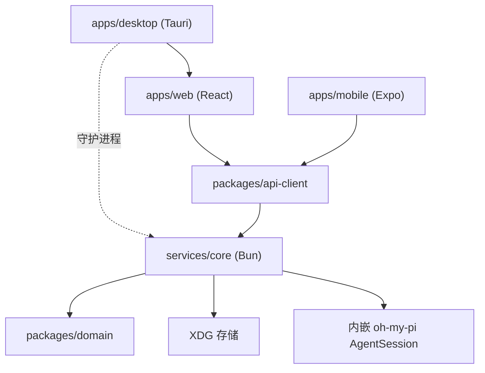

# PaperWithA 项目总览

- 文档日期：2026-10-03
- 性质：当前实现与目标设计的分离说明
- 读者：接手工程师、Coding Agent、评审

## 1. 项目是什么

PaperWithA 是本地优先的论文研究工具。核心体验：把论文导入本地库，agent 读过之后，你直接问它。

目标设计（`docs/redesign-plan.md`）是一条闭环：

1. 导入 PDF / TXT / Markdown；
2. 左栏读原文，选中文字可以「问这段」；
3. 右栏流式回答，引用标注页码，点页码跳回原文；
4. 会话可新建、切换、删除；
5. Web、Desktop、Mobile 连同一个 core，看到同一批论文与会话。

## 2. 成熟度

### 已实现并验证

- `services/core`：Bun 服务，XDG 存储、论文索引、按需文本抽取、HTTP + WebSocket。
- 内嵌 agent：进程内 `createAgentSession()`，流式 `text_delta`，页号引用解析。
- `packages/domain` 与 `packages/api-client`：跨端类型与客户端，单元测试覆盖。
- core 存储与 ingest：Vitest 覆盖索引对齐、去重、按需抽取、PDF 文本层。
- 端到端烟测 `pnpm probe:agent`：上传 → 建会话 → 真实提问 → 收到流式回答。
- Web：PDF.js canvas + 文本层阅读、选区提问、流式 Chat、引用跳页、KaTeX 公式排版、
  每篇论文独立的阅读器缩放。
- 图件生成：图解（SVG）、动画（MP4）、幻灯片（自包含 deck.html），按能力探测开关按钮。
- CI（`native-builds`）：`checks` + linux/windows 的 `tauri build`，两次运行均通过。

### 摘要描述的旧能力

`docs/adr` 里 0002（docking）、0003（同步）、0004（多论文上下文）、0005（插件）
已被 ADR-0006 取代，对应代码已从仓库删除。这些是目标设计，不是当前实现。

### 尚未实现

- Mobile 的 PDF 渲染、图件 UI 与离线缓存；Mobile 只读文本。
- 段落、图表、公式级的文档结构；当前只到「页」。
- 跨设备同步、插件系统、多论文上下文、Reading Brief、OCR。
- agent 会话的进程内持久化：进程重启后需重建，且该会话的历史不会回灌给模型。
- Desktop 的打包分发；core 守护只在开发路径验证。

## 3. 技术栈

| 层 | 技术 |
|---|---|
| 包管理 | pnpm 9 workspace |
| core | Bun 1.3+、TypeScript、node:fs / node:crypto |
| agent | `@oh-my-pi/pi-coding-agent` 内嵌 |
| Web | React 19、Vite 6、pdf.js、KaTeX |
| Desktop | Tauri 2、Rust 2021 |
| Mobile | Expo 52、React Native 0.76 |
| 图件渲染 | `rsvg-convert`、`ffmpeg`（可选 `manim`） |
| 测试 | Vitest、`pnpm probe:agent` 端到端烟测、GitHub Actions |

## 4. 模块图

## 5. 主要链路

### 导入与阅读

1. Web 用 `FormData` 把文件 POST 到 `/api/papers`；
2. core 计算 sha256 前 12 位作为论文 id，落盘并抽取每页文本；
3. Web 用 `GET /api/papers/:id/text` 渲染文本页；PDF 另取 `GET /api/papers/:id/file` 用 pdf.js 渲染。

### 提问与回答

1. 没有会话时 Web 自动 `POST /api/sessions`；
2. `POST /api/sessions/:id/prompt` 返回 `runId`，core 立刻把用户消息与空的助手消息落盘；
3. core 内嵌 agent 以「论文工作目录 + paper.md」运行，事件经 WebSocket `/api/events` 广播；
4. 回答结束时 core 解析 `[p.N]` 得到引用，写入会话并广播 `message-completed`。

### 抽取

- 首次读取论文文本时抽取；PDF 走 pdf.js 文本层，纯文本按 45 行分页。
- 文本缓存在 `text/<id>.json`，之后不再重复抽取。

## 6. 设计优势

- 单一事实源（core），三端行为一致；
- agent 内嵌，无外部 CLI 依赖；
- 论文 id 由内容决定，重复导入天然幂等；
- 引用必须命中真实页号，否则丢弃；
- 依赖少：两个共享包、一个服务、三个宿主。

## 7. 风险

- core 只能用 Bun 跑；Node 环境无法加载内嵌 SDK。
- 内嵌 SDK 会把 oh-my-pi 的扩展、LSP、MCP 加载一起带进进程，冷启动更重。
- 论文全文按会话注入，超长论文会触发 SDK 的上下文压缩。
- 移动端依赖用户填对 `EXPO_PUBLIC_CORE_URL`，否则连不上。
- Desktop 的 core 进程守护目前只在开发环境验证过，未做打包分发。

## 8. 推荐接手顺序

1. 读 `AGENTS.md` 与 `docs/next-session-handoff.md`。
2. 读 `docs/redesign-plan.md` 了解本次重做的取舍。
3. 跑 `pnpm typecheck`、`pnpm test`、`pnpm probe:agent` 确认基线。
4. 需要动 UI 时，先在真实浏览器按窗口契约验收。
