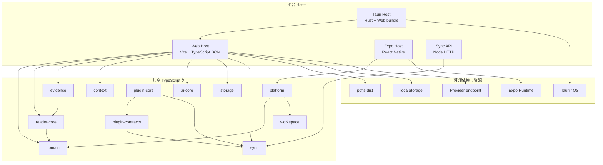
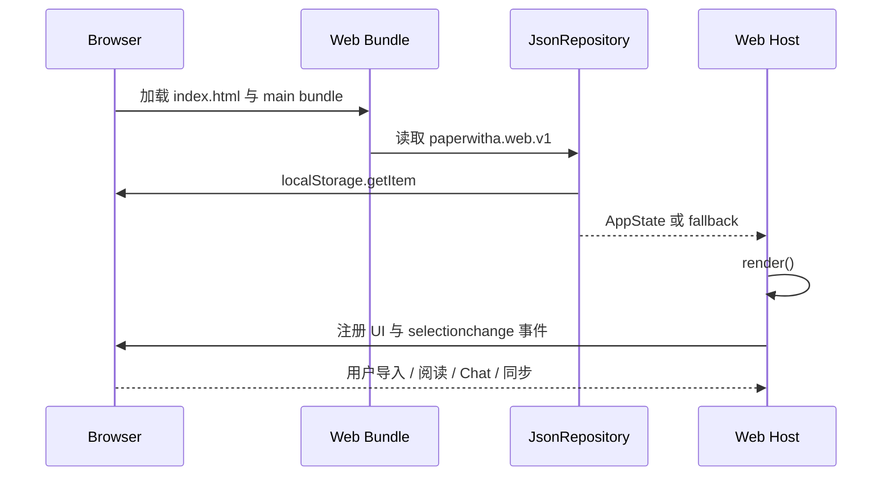
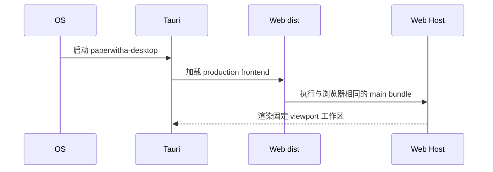
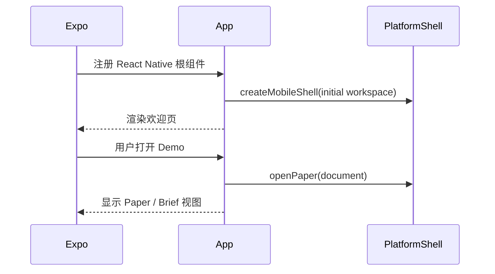
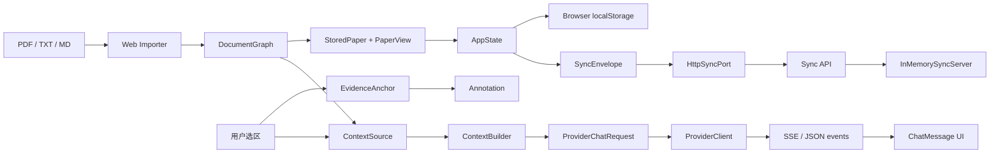
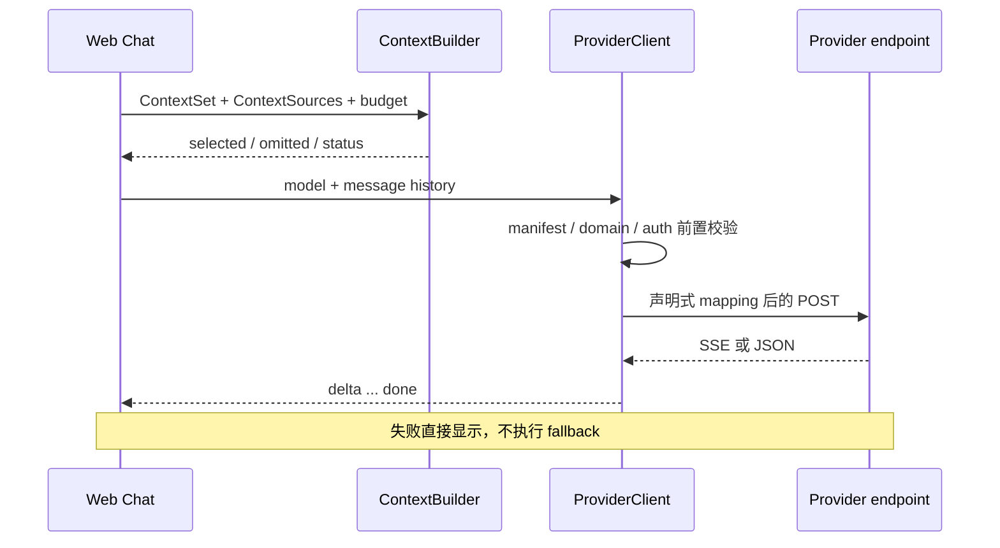
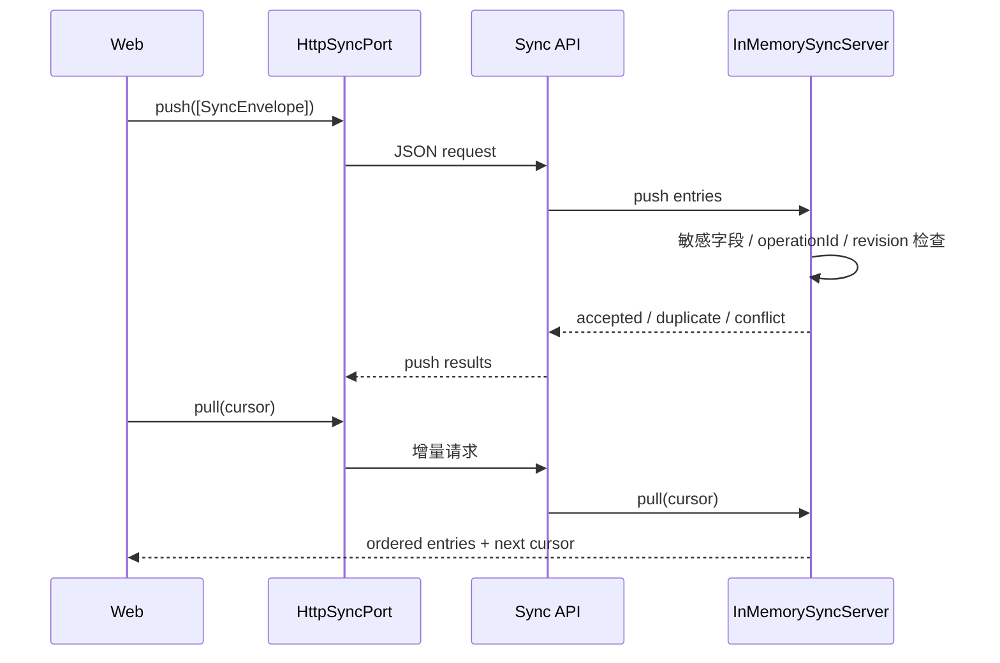

# PaperWithA 技术架构

- 文档日期：2026-07-24
- 范围：当前仓库真实实现；目标能力单独标注
- 读者：技术负责人、实现 Agent、Reviewer、跨端工程师

## 1. 架构结论

PaperWithA 是 pnpm 管理的 TypeScript monorepo，采用“平台 Host → 共享业务包 → 外部端口”的依赖方向：

- Web Host 直接组合共享包，是当前功能最完整的运行时；
- Tauri Desktop Host 加载 Web production bundle，Rust 只保留原生边界入口；
- Expo Mobile Host 使用 React Native UI 和最小 PlatformShell；
- 同步 API 是独立 Node HTTP 进程，但当前存储为内存实现；
- Gate 0 探针独立验证 PDF、Graph、Docking、Provider、Context 和 Sync 高风险假设。

当前代码不是完整的 Clean Architecture：Web Host 在单一入口中直接处理 UI、状态、PDF 导入、Provider 和同步。共享包提供了可演进边界，但尚未由统一 application service 或 event log 组织。

## 2. 系统架构图

依赖方向的重要性质：共享包不依赖 Web DOM 或 Tauri；`storage` 的 BrowserStoragePort 是目前唯一明确的平台实现之一；应用 Host 可以依赖多个共享包。

## 3. 仓库与模块职责

### 3.1 Host 层

#### Web Host

当前 Web Host 使用 Vite 和原生 DOM 模板。它负责：

- AppState 读取、迁移默认值和 localStorage 写入；
- PDF / 文本导入和 DocumentGraph 创建；
- 论文库、阅读器、Chat、Brief、Provider 配置和同步状态渲染；
- selectionchange、scroll、form submit 等浏览器事件；
- 调用 ContextBuilder、ProviderClient、Annotation、PaperView 和 HttpSyncPort。

窗口布局契约为固定 viewport 外壳，论文、Chat、Brief 和论文库内部独立滚动。Desktop 复用该 CSS，因此页面高度错误会同时影响浏览器和客户端。

#### Tauri Desktop Host

Rust Host 当前仅创建 Tauri Builder 并加载配置。配置指定：

- production frontend 为 Web `dist`；
- 默认窗口 1440×900，最小 960×640；
- bundle identifier 为 `com.paperwitha.desktop`；
- Linux / Windows CI 构建入口已存在。

文件系统、密钥链、系统窗口和原生事件还没有 command 实现。

#### Expo Mobile Host

Mobile Host 当前维护本地 `reader | brief` UI 状态，通过 PlatformShell 打开内置 Demo Paper。它证明 workspace package 可被 Metro 消费并可构建三平台 bundle，但尚未实现正式移动 Host 能力。

#### Sync API

Sync API 暴露 push / pull 两个职责接口：

- push：要求数组 payload，交给 InMemorySyncServer；
- pull：读取可选 cursor，返回增量 entries；
- OPTIONS：支持当前宽松 CORS；
- 其他路由返回 not-found；解析与业务错误返回 400。

该 API 无认证、限流、持久化和 workspace 隔离，只适合原型与测试。

### 3.2 共享领域层

#### Domain

最小 DocumentGraph 由 graphId、documentId、documentVersionId 和页面集合构成。页面包含文本、页号、可选 layout 指标和 confidence。完整 Section / Paragraph / Figure 等目标模型尚未实现。

#### Reader Core

- DocumentGraphCache：按 documentVersionId 共享异步解析 Promise；失败时清除缓存，允许重试。
- visiblePageNumbers：计算视口中心页与 buffer 页。
- PaperViewState：独立保存 scrollAnchor、zoom、selectedAnchorId。
- EvidenceAnchor 创建：检查版本、页范围、顺序和字符 offset，生成跨页起止节点范围。

#### Evidence

Annotation 保存 document / version / anchor、类型、选中文本、note、tags 和时间。创建时拒绝无效 anchor 和空文本。

#### Workspace

LayoutTree 由 stack 和 split 节点组成；命令支持 swap、mergeTab 和 splitPane；LayoutHistory 管理历史。目标中的 detach、restore、redo 完整 Host 行为尚未接入产品。

#### Context

ContextBuilder 的确定性顺序：

1. 只保留 ContextSet.documents 内的来源；
2. 按 fixedSourceIds 顺序保留固定来源；
3. 固定来源超预算则显式返回 budget_exceeded；
4. 普通来源按查询词命中数排序，相同分数按 sourceId；
5. 不能容纳的来源进入 omittedSourceIds。

当前 token 估算是空白分词计数，不是具体模型 tokenizer。

### 3.3 外部端口与扩展层

#### Provider

ProviderManifest 允许三种 mapping：JSON Pointer、literal 和 list。校验器拒绝不支持的 API 版本、脚本 mapping、未声明 endpoint domain 和不完整认证。

ProviderClient：

- 构造时验证 manifest；
- API key provider 必须获得只存在运行时的 credential；
- HTTP JSON 通过 responseMapping 产生单个 delta + done；
- SSE 按空行切事件，解析 `data:`，应用声明式 responseMapping；
- 非 2xx 或 malformed stream 抛出结构化错误；
- 不包含自动供应商 fallback。

#### Sync

SyncEnvelope 携带 operationId、actor / device、entity、baseRevision、payload、createdAt 和可选 serverSequence / tombstone。

- Outbox 以 operationId 去重，并在 enqueue 前递归拒绝 apiKey、api_key、secret、password；
- IdempotentInbox 防止重复投影并检查 baseRevision；
- InMemorySyncServer 分配单调 serverSequence 和 revision；
- HttpSyncPort 将 SyncPort 映射到 HTTP push / pull。

#### Plugin

当前 PluginManifest 只有 pluginId、version、capabilities；SyncPlugin 只有 start / pause / stop。PluginHost 支持安装、卸载和同步插件激活，并强制单 Workspace 仅一个 active sync target。目标中的 capability grants、网络白名单、任务取消和隔离尚未实现。

#### Storage

StoragePort 是同步 key-value 接口；现有 MemoryStoragePort、BrowserStoragePort 和 JsonRepository。JsonRepository 在 JSON 损坏时删除坏值并返回 fallback。

## 4. 运行时启动链路

### 4.1 Web

Web Host 在模块加载尾部注册一次 selectionchange，再执行首次 render。每次 render 只重新绑定当前 DOM 节点事件，避免 document 级监听器重复累积。

### 4.2 Desktop

当前没有 Rust command 往返，因此产品逻辑与 Web 完全一致。

### 4.3 Mobile

## 5. 数据流图

关键缺口：ChatMessage 目前没有持久 ContextSnapshot；同步发送的是整个简化 Workspace payload，而不是本地 event log 的细粒度操作。

## 6. Provider 请求链路

隐私边界：API Key 只保存在 ProviderConfig 运行时对象中，不写入 AppState；SyncEnvelope 对常见敏感键再次拒绝。

## 7. 同步请求链路

服务重启会清空 operations、revisions 和 sequence；生产化前必须替换为持久 operation log。

## 8. 状态与持久化

### Web AppState

当前 AppState 保存：

- papers：每篇论文的 graph、view、chat、annotations、brief；
- activePaperId、activeTab；
- sidebar / assistant 开关；
- selectedText、selectedPage；
- contextSourceIds 与 contextTexts。

ProviderConfig、syncEndpoint、syncCursor 和 syncStatus 是会话内变量，不持久化。整份 AppState 同步 JSON 写入 localStorage，适合当前 Demo 规模，不适合大型 DocumentGraph。

### PlatformShell

PlatformShell 通过 structuredClone 隔离读写，支持 getState、subscribe、openPaper 和 setLayout。它是跨端演示边界，不是完整领域 store。

## 9. 错误处理与降级

- localStorage JSON 损坏：删除坏值并使用 fallback；
- PDF 导入失败：Web alert，未创建论文；
- 无 text layer 页面：写入明确 page-only fallback 文本和低 confidence；产品尚未触发 OCR；
- Context 固定来源超预算：返回 budget_exceeded，不静默删除；
- Provider 非 2xx / malformed stream：Chat 显示错误，不切换供应商；
- Sync 失败：状态显示 offline 并 alert，本地数据保留；
- 插件目标冲突：激活前拒绝第二个同步目标。

## 10. 构建、测试与发布

### TypeScript / Web

根命令负责 strict typecheck、Vitest、Vite build 和 Gate 0。Web、Mobile、API 另有独立 tsconfig 检查。

### Desktop

Tauri 生产构建必须先生成 Web dist。CI 使用 Ubuntu 24.04 / Windows 2022；Linux Dockerfile安装 WebKitGTK、librsvg 和相关原生依赖。当前宿主已产出 Linux DEB / RPM 并完成进程启动烟测。

### Mobile

Expo export 已验证 Web、Android 和 iOS JavaScript / Hermes bundle；这不等于设备上的文件、触摸、SQLite 或安全存储验收。

### 测试层级

- 包级行为测试：DocumentGraph、PaperView、selection、layout、context、provider、evidence、storage、sync、plugin、platform；
- HTTP 边界测试：Provider 本地 SSE、Sync API push / pull；
- Gate 0：六项 deterministic probe；
- 浏览器人工自动化验收：Web 主要流程和窗口尺寸；当前尚未固化为仓库内 E2E suite。

## 11. 架构债务与演进建议

1. 将 Web 单文件 Host 拆为 importer、state repository、reader view、chat service、provider settings 和 sync coordinator；先保留行为，再迁移框架。
2. 决定正式 Web Host 是否继续原生 DOM 或按 ADR 切回 React；不要长期维持设计文档和实现两套事实。
3. 用正式 ChatSession / ContextSnapshot / CitationReference 替换 `StoredPaper.chat` 简化模型。
4. 用 ReadingBriefVersion + user overlay 替换字符串 brief。
5. 将 PDF 解析改为首屏优先、按需页面解析和 DocumentGraphCache；把 Gate 0 OCR 接入明确用户流程。
6. 将 LayoutTree 与 Dockview Host 接通，并按命令日志实现 undo / redo / restore / detach。
7. 将同步服务替换为持久 operation log，增加 workspace 隔离、认证、请求限制和冲突恢复。
8. 扩展 PluginManifest 与 CapabilityGrant，并实现取消、超时、进度、并发和输出大小限制。
9. Desktop 增加文件、密钥链和原生窗口命令；Mobile 增加 ReaderAdapter、SQLite 和安全存储。
10. 把正式首版验收场景固化为 Web / Desktop / Mobile E2E，关闭 Gate 时保留机器证据。
