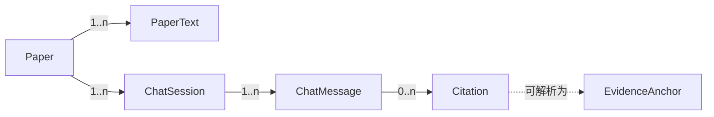

# PaperWithA 领域模型

- 文档日期：2026-10-03
- 对应实现：`packages/domain/src/`

## 1. 实体

### 1.1 论文（Paper）

用户导入的一份文献。id 是文件内容 sha256 的前 12 位，因此同样内容只存在一份。

```ts
interface PaperSummary {
  id: string;          // 内容哈希前 12 位
  title: string;       // 由文件名推导
  fileName: string;    // 用户看到的原始名
  storedName: string;  // 磁盘上的名字
  size: number;
  pageCount: number;
  addedAt: string;     // ISO 时间
}
```

### 1.2 页（PaperPage）与页文本（PaperText）

```ts
interface PaperPage { pageNumber: number; text: string; }
interface PaperText { paperId: string; pages: PaperPage[]; }
```

- 页号从 1 开始，连续。
- PDF 的页文本来自 pdf.js 文本层；纯文本每 45 行算一页。
- 页文本是证据锚点的唯一基准。

### 1.3 会话（ChatSession）与消息（ChatMessage）

```ts
type ChatRole = "user" | "assistant";
interface ChatMessage { id, role, text, createdAt, citations: Citation[] }
interface ChatSession { id, paperId, title, createdAt, updatedAt, messages: ChatMessage[] }
```

一个会话只属于一篇论文。论文删除时会话一并删除。

### 1.4 引用（Citation）

```ts
interface Citation { pageNumber: number; quote: string; }
```

模型在回答里写 `[p.N]`，core 解析成引用。`pageNumber` 必须命中该论文真实页号，否则整条丢弃。
`quote` 是标记前最近一句话，用来在 UI 里给出引用依据。

### 1.5 证据锚点（EvidenceAnchor）

```ts
interface EvidenceAnchor {
  paperId: string; pageNumber: number;
  startOffset: number; endOffset: number;
  quote: string;
}
```

把一段文本绑定到某页的字符范围。`createAnchor` 在页文本里找 `quote`，找不到返回 `null`，
不返回「大概位置」。偏移以 `PaperPage.text` 为准。

### 1.6 core 事件（CoreEvent）

```ts
type CoreEvent =
  | run-started   | text-delta   | tool-start | tool-end
  | message-completed | run-completed | run-failed
```

都带 `sessionId` 与 `runId`。命令走 HTTP，事件只走 WebSocket。

## 2. 不变量

1. 论文 id 由内容决定；同样内容重复导入不产生第二条记录。
2. `PaperPage.pageNumber` 从 1 连续递增，不跳号。
3. 引用只认真实页号；解析不出页码的内容不进 `Citation`。
4. 会话的消息顺序即落盘顺序；流式回答先写空助手消息，结束后原地覆盖。
5. 同一会话同时只允许一个 run；并发提问返回 409。
6. core 是唯一写入方。UI 不缓存业务状态，只保留视图状态。
7. 论文删除是级联的：文件、文本缓存、会话一起消失。
8. agent 的工作目录只包含论文副本；会话之间不共享上下文。
9. 未进入某会话上下文的论文，不会出现在该会话的回答里。
10. API Key 不落仓库、不写日志、不进测试 fixture。

## 3. 关系


