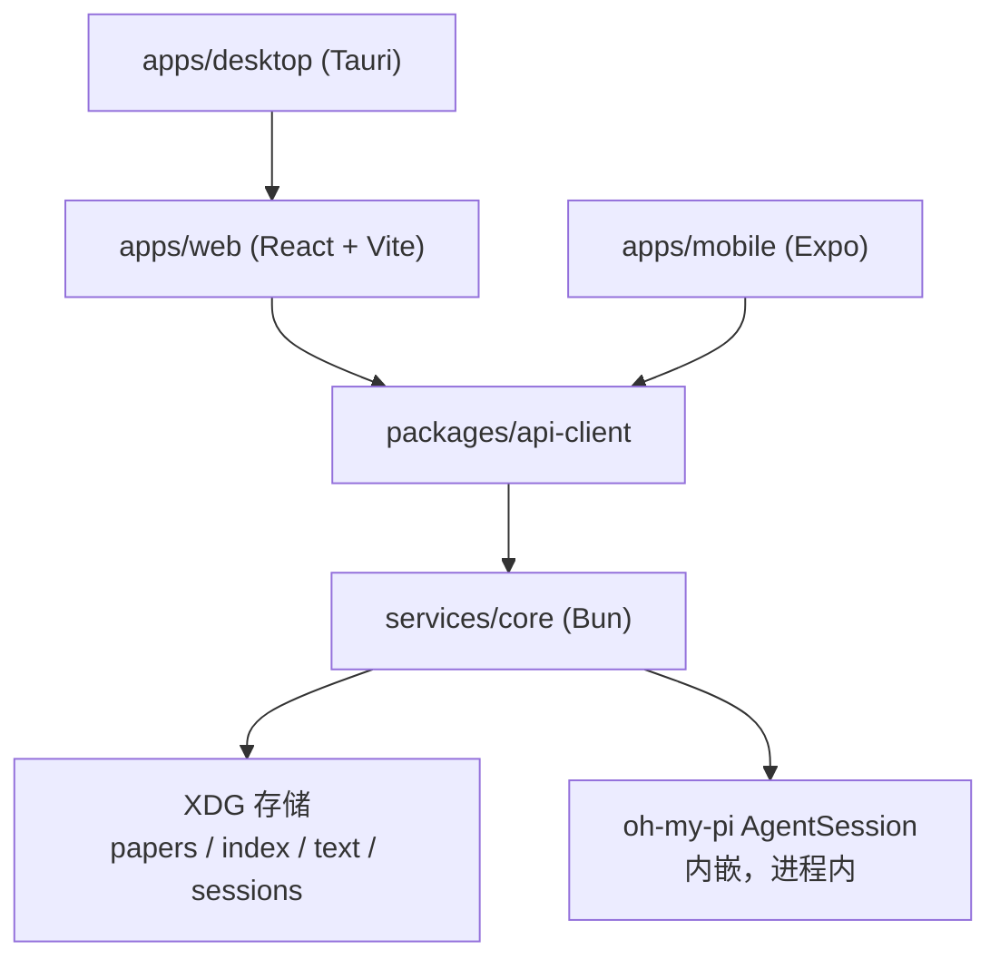

# PaperWithA 重做方案

- 日期：2026-10-03
- 性质：当前实现的问题清单 + 目标架构 + 迁移步骤
- 决策依据：用户确认保留三端、激进清理、内嵌 oh-my-pi、Web 用 React + Vite

## 1. 为什么重做

旧实现能编译，59 个测试全过，但产品主路径是断的。下面每条都有本次实测证据。

**1.1 Agent 对话在 UI 里不存在。**
`renderWorkspace`（旧 `apps/web/src/main.ts:275`）只渲染阅读器和终端；`sendAgentPrompt`、`renderBrief` 没有调用方。真实浏览器打开 demo 后，`#chat-input`、`#chat-messages`、发送按钮、`.brief-content` 数量全为 0。默认回答 `answerFor`（旧 `main.ts:214`）是模板字符串，不是模型输出。

**1.2 PDF 主路径断链。**
导入 PDF 后 `setupPdfViewer` 把阅读区换成 `<iframe>`。实测结果：`[data-page-number]=0`、`.ink-canvas=0`、文本段落 `p=0`。选区、批注、ink 全部只对 TXT/MD 生效。

**1.3 Agent 运行时不可达。**
`packages/agent-runtime-node` 约 800 行适配器只被 `apps/desktop/src/index.ts` 引用，而该文件无构建、无引用方。唯一活的 agent 调用是 watcher 的 `pi --mode oneshot`，但本机 `pi` 未安装。

**1.4 两套存储互不相认。**
Web 把整份 AppState（含 base64 blob）写 localStorage；services 用 XDG `paper-store`。UI 删论文靠硬编码 `http://localhost:4121`。

**1.5 死重。**
`design-tokens`、`plugin-sdk`、`services/worker` 只有 `.gitkeep`；`plugin-core`、`sync` 大部分、`workspace`、`contracts` 只被测试或 probe 引用；mobile 是 548 行演示壳。17 个包里 6 个对产品零贡献。

**1.6 文档与现实冲突。**
AGENTS.md 说终端要换 xterm.js（早已换）；handoff 说 watcher 已恢复（依赖缺失的 `pi`）；`00-project-overview.md` 说 Web 用 HttpSyncPort，源码里没有。

## 2. 目标

一句话：你有篇论文，agent 读过了，你问它。其余都是次要的。

做完后用户能连续完成这一条链路，中间没有断点：

1. 导入 PDF 或 TXT/MD；
2. 左面板读到原文，选中文字能加进上下文或批注；
3. 右面板提问，agent 流式回答，引用能跳回原文页；
4. 会话能新建、切换、删除，重开浏览器后还在；
5. Desktop 和 Mobile 连同一个本地 core，看到同一批论文和会话。

## 3. 架构



- **单一事实源**：`services/core` 独占存储与 agent。UI 不再写 localStorage 的业务状态。
- **单一服务端口**：core 监听 `127.0.0.1:4130`，HTTP + WebSocket。
- **Agent 内嵌**：core 进程内 `createAgentSession()`，不 fork 外部 CLI。
- **PDF 渲染**：pdf.js canvas + text layer，不用 iframe。
- **三端共用**：Desktop 加载 web 产物并守护 core 进程；Mobile 通过 HTTP 连 core。

### 3.1 内嵌 agent 的实测证据

本机 Bun 1.3.14，`@oh-my-pi/pi-coding-agent@18.4.12`。隔离目录实测：

```text
[spike] session ready in 376ms sessionId=01a0fd7c-...
[spike] agent_end
[spike] answer: "PONG"
[spike] done in 1508ms
```

- 入口：`createAgentSession(options)`，来自 `@oh-my-pi/pi-coding-agent`。
- 流式：`session.subscribe(listener)`，事件 `message_update.assistantMessageEvent.type === "text_delta"`。
- 控制：`session.prompt()`、`steer()`、`followUp()`、`abort()`、`setModel()`、`dispose()`。
- 会话：`sessionManager: SessionManager.inMemory()`，会话归属由 PaperWithA 自己落盘。
- 凭证：默认读 `~/.omp/agent/agent.db`，与用户自己的 omp 共用；可用 `PAPERWITHA_AGENT_DIR` 覆盖。
- 运行时约束：SDK 依赖 Bun 全局对象与 `bun:sqlite`，core 必须以 Bun 运行。

## 4. 目标仓库结构

```text
apps/web             React 19 + Vite 6：论文库、阅读器、Chat
apps/desktop         Tauri 2 壳 + core 进程守护
apps/mobile          Expo：论文列表 + 文本阅读 + Chat
packages/domain      跨端类型：DocumentGraph、Paper、ChatSession、Citation
packages/api-client  core 的类型化客户端（HTTP + WS）
services/core        Bun 服务：存储、ingest、agent、HTTP/WS
docs/
```

删除：`packages/{agent-core,agent-runtime-node,ai-core,context,contracts,design-tokens,evidence,paper-store,platform,plugin-contracts,plugin-core,plugin-sdk,reader-core,storage,sync,workspace}`、`services/{api,pty,watcher,worker}`、`probes/`、`fixtures/`、`apps/desktop/src`（旧 TS 层）。

保留并重写：`apps/web`、`apps/desktop/src-tauri`、`apps/mobile`。

## 5. 存储布局

```text
~/.local/share/paperwitha/
  papers/<hash12>-<name>     原始文件
  index.json                 论文索引（id、标题、hash、状态、页数）
  text/<hash>.json           每页文本 DocumentGraph
  sessions/<sessionId>.json  Chat 会话：消息、上下文快照、引用
```

索引与 `papers/` 目录互为事实源：目录里的 PDF 会在启动时补进索引。

## 6. Core API

```text
GET    /api/health                     服务与 agent 状态
GET    /api/papers                     论文列表
POST   /api/papers                     上传（multipart），返回论文条目
GET    /api/papers/:id/text            每页文本
DELETE /api/papers/:id                 删除论文、文本、会话
GET    /api/sessions?paperId=          会话列表
POST   /api/sessions                   新建会话
DELETE /api/sessions/:id               删除会话
POST   /api/sessions/:id/prompt        发送提问，返回 runId
POST   /api/sessions/:id/abort         中止当前 run
WS     /api/events                     agent 事件流（delta、tool、end、error）
```

## 7. 迁移步骤

1. 清理：删除第 4 节列出的目录，更新根 `pnpm-workspace.yaml` 与 `package.json`。
2. `packages/domain`：定义跨端类型与不变量。
3. `services/core`：存储 → ingest → HTTP → 内嵌 agent → WS 事件。
4. `packages/api-client`：按第 6 节实现类型化客户端。
5. `apps/web`：React 重写，按功能拆 `library`、`reader`、`chat` 三个模块。
6. `apps/desktop`：Rust 侧守护 core 进程，窗口加载 web 产物。
7. `apps/mobile`：接同一套 API，去掉假回答。
8. 文档：重写 AGENTS.md、README、handoff，ADR 标记被取代的决策。

## 8. 验收

- `corepack pnpm typecheck` 通过。
- `corepack pnpm test` 通过，含 core 的存储、ingest、agent 会话测试。
- 真机浏览器：导入 PDF → 阅读器有文本层 → 选中有工具栏 → 提问有流式回答 → 引用跳页。
- 窗口契约：1440×900 与 390×844 下 `document.body.scrollHeight === innerHeight`。
- 重启 core 后论文与会话仍在。
- Desktop 能启动并存取同一批论文。

## 9. 边界

- Sync、插件系统、docking 布局、OCR 不在本次范围。相关 ADR 标记为已取代。
- Mobile 不做 PDF 渲染，只做文本阅读。
- Agent 的模型与凭证沿用用户 `~/.omp/agent` 配置，不再做独立的 Provider 配置界面。
